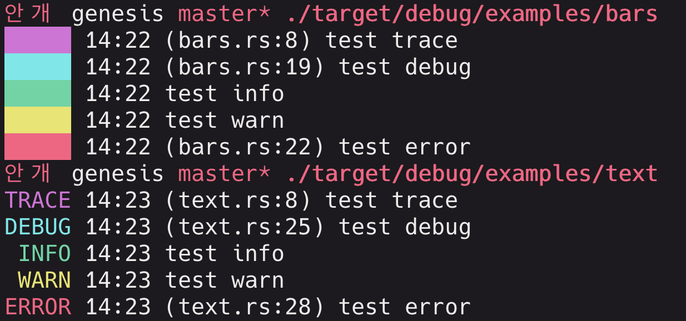

# Genesis

Genesis is a simple and pretty logging facade for the `logs` crate.
To ensure the library stays minimalist and slim, there is little to no configuration, simply the date format and output style.


## Usage

Add the dependency to your `Cargo.toml`:
(temporary until I upload the library to crates.io)

```toml
[dependencies]
log = "0.4"
genesis = { git = "https://github.com/tachyon-software/genesis" }
```

Add some usage to your application:

```rust
extern crate genesis;
#[macro_use] extern crate log;

fn main() {
    genesis::init();
    info!("such information");
    warn!("o_O");
    error!("much error");
}
```

## License

Licensed under either of

- MIT license ([LICENSE-MIT](LICENSE-MIT) or http://opensource.org/licenses/MIT)

